# Afterglow

<p align="center">
  
</p>

<p align="center">
  <a href="https://github.com/liminal-hq/afterglow-themes/actions/workflows/ci.yml"></a>
  <a href="https://github.com/liminal-hq/afterglow-themes/releases"></a>
  
  
  
  
</p>

Afterglow is the Liminal HQ colour theme for the [OpenCode](https://opencode.ai) terminal UI, for VS Code and for [Midnight Commander](https://midnight-commander.org): the soft orange, rose and purple that linger on the horizon after the light goes, set against a near-black void. Each comes in three variants, and the OpenCode one has a see-through variant so your terminal's own background and blur show through.

> **Status:** early development. The themes are complete and pass the schema and contrast checks in CI. The OpenCode themes target the V2 theme format and are tested against OpenCode v2.0.21. The VS Code extension is not yet published to the Marketplace; install it from a release.

## The OpenCode themes

| Theme             | Mode  | What it is                                                                                                                                                                                |
| ----------------- | ----- | ----------------------------------------------------------------------------------------------------------------------------------------------------------------------------------------- |
| `afterglow`       | Dark  | The signature theme. The liminalhq.ca void with brand orange and purple accents and a transparent background, so your terminal's opacity or blur shows through. Dialogs stay near-opaque. |
| `afterglow-dark`  | Dark  | A solid, deep indigo-black theme with purple and blue accents, for terminals without transparency or when you want a calmer, flatter surface.                                             |
| `afterglow-light` | Light | A warm paper theme with deeper accents that hold 4.5:1 contrast on light backgrounds.                                                                                                     |

All three cover every OpenCode surface: text and actions, backgrounds and raised panels, borders, diffs, syntax highlighting and Markdown.

## The VS Code themes

| Theme             | Mode  | What it is                                                                |
| ----------------- | ----- | ------------------------------------------------------------------------- |
| `Afterglow`       | Dark  | The `#050507` void with orange accents, for a deep, high-contrast editor. |
| `Afterglow Dark`  | Dark  | A softer deep indigo-black with purple accents.                           |
| `Afterglow Light` | Light | A warm paper theme with deeper accents that hold 4.5:1 contrast.          |

The syntax colouring keeps every TextMate scope rule and semantic token override from VS Code's built-in **Dark+** and **Light+** themes, recoloured with the Afterglow palette, so languages colour the way you expect. The editor, tabs, side bar, status bar, panels and terminal are all coloured deliberately rather than inherited from VS Code's defaults. See [docs/vscode-theme.md](docs/vscode-theme.md).

## The Midnight Commander skins

| Skin              | Mode  | What it is                                                                                                                                      |
| ----------------- | ----- | ----------------------------------------------------------------------------------------------------------------------------------------------- |
| `afterglow`       | Dark  | The `#050507` void with orange accents. The panels, viewer and editor use the terminal's own background, so transparency and blur show through. |
| `afterglow-dark`  | Dark  | Solid deep indigo-black with purple accents.                                                                                                    |
| `afterglow-light` | Light | Warm paper with deeper accents that hold 4.5:1 contrast.                                                                                        |

Every section of the skin is coloured deliberately: the file list and file types, the cursor and marked files, menus, dialogs, errors, the button bar, the help, viewer, editor and diff viewer. Each skin also has a `-256` fallback (for example `afterglow-dark-256`) for terminals that report 256 colours but not truecolour. See [docs/mc-skin.md](docs/mc-skin.md).

## Install

### OpenCode

Download the latest bundle from the [releases page](https://github.com/liminal-hq/afterglow-themes/releases), then unpack it into OpenCode's global themes directory:

```sh
mkdir -p ~/.config/opencode/themes
unzip afterglow-themes-v*.zip -d ~/.config/opencode/themes
```

Restart OpenCode, run `/themes` and pick an Afterglow theme. To make it the default, set it in `~/.config/opencode/cli.json`:

```json
{
	"theme": { "name": "afterglow", "mode": "dark" }
}
```

A project's `.opencode/themes/` directory works too, if you only want Afterglow for one project. Each release also lists a `SHA256SUMS` file so you can check the download.

### VS Code

Download `afterglow-vscode-vX.Y.Z.vsix` from the [releases page](https://github.com/liminal-hq/afterglow-themes/releases) and install it:

```sh
code --install-extension afterglow-vscode-v*.vsix
```

Then run **Preferences: Color Theme** (`Ctrl+K Ctrl+T`) and pick an Afterglow theme.

### Midnight Commander

Download `afterglow-mc-skins-vX.Y.Z.zip` from the [releases page](https://github.com/liminal-hq/afterglow-themes/releases) and unpack it into mc's skins directory:

```sh
mkdir -p ~/.local/share/mc/skins
unzip afterglow-mc-skins-v*.zip -d ~/.local/share/mc/skins
```

Then start mc with `mc -S afterglow`, or pick a skin under **Options > Appearance** and save the setup. The skins need mc 4.8.19 or newer built against S-Lang, and truecolour needs `COLORTERM=truecolor` (or `24bit`) in a terminal that supports it, with `TERM=xterm-256color`. If your terminal or session cannot offer that (over SSH, for example), use the `-256` skin: `mc -S afterglow-256`. Without `COLORTERM`, mc rounds the truecolour skins down to 16 colours, which looks wrong. The mc editor's syntax colours come from your terminal's own palette rather than the skin.

### From source

With [Bun](https://bun.sh) installed:

```sh
git clone https://github.com/liminal-hq/afterglow-themes.git
cd afterglow-themes
bun install
bun run install:themes
```

This builds the themes and copies them into `~/.config/opencode/themes/` (or `$XDG_CONFIG_HOME/opencode/themes/`). For Midnight Commander, run `bun run install:mc` to copy the skins into `~/.local/share/mc/skins/` (or `$XDG_DATA_HOME/mc/skins/`).

## Transparency

The `afterglow` OpenCode theme sets the main background to `transparent` and keeps raised surfaces such as the prompt and tool blocks a solid dark tone (OpenCode does not appear to blend a box with your terminal background), so the effect depends on your terminal supporting background opacity (Kitty, Alacritty, WezTerm, Ghostty and Windows Terminal all do). If you would rather have a solid background, use `afterglow-dark`. The `afterglow` Midnight Commander skin works the same way, using the terminal's default background for the panels.

## Where the colours come from

The palette was gathered by scanning the [Liminal HQ](https://github.com/liminal-hq) repositories for colour tokens and counting what recurs. The pattern is a calm near-black background, a warm orange-to-rose-to-purple family of accents, and cool cyan and blue for information.

- **The void and the accents** come from liminalhq.ca: `#050507` for the background, `#e0e0e0` for text, `#b4bfce` for muted text, and the orange `#ffaa40`, rose `#f43f5e`, purple `#a78bfa`, cyan `#22d3ee` and blue `#60a5fa` accents.
- **Greens and yellows** (`#2ec66a`, `#fbbf24`) recur across SMDU, Threshold and Flow.
- **The solid dark surfaces** (`#0f0e1a`, `#1a1828`) come from Jar and the indigo-black tones used across the apps.
- **The light paper theme** uses Jar's warm `#fbfaf6` and `#2b2a33`, Cadence's `#5e44cc` purple and surface tones, and Threshold's `#2563eb` blue.

See [docs/theme-format.md](docs/theme-format.md) for how the palette becomes OpenCode tokens and the design decisions behind the themes.

## Development

The themes are generated, so edit the palette and rebuild rather than editing the JSON by hand.

```sh
bun install
bun run build            # regenerate themes/*.json, vscode/themes/*.json and mc/skins/*.ini
bun run validate:themes  # check the schema rules and 4.5:1 text contrast
bun run validate         # the full local gate that mirrors CI
bun run bundle           # build the release assets (including the .vsix) into dist/release
```

- `scripts/palette.mjs` holds the brand colours, the deeper light-mode variants and the neutral ramps.
- `scripts/build.mjs` turns them into OpenCode V2 themes. Each hue is a nine-step ramp with the brand colour on step `200`, matching how OpenCode's built-in themes are laid out.
- `scripts/build-vscode.mjs` builds the VS Code themes from the same palette, using the Dark+ and Light+ scope rules in `vscode/upstream/` as the structural base.
- `scripts/build-mc.mjs` builds the Midnight Commander skins (truecolour and 256-colour) from the same palette, and `scripts/validate-mc.mjs` checks every section and key against `scripts/mc-skin-keys.json`, the colour syntax and about 80 contrast pairs per skin.
- `scripts/validate-themes.mjs` mirrors the V2 theme schema bundled in OpenCode (the published JSON schema for V2 themes is not available yet), resolves every reference, and checks the contrast of text, syntax and Markdown colours. `scripts/validate-vscode.mjs` does the same for the VS Code themes (about 90 foreground and background pairs, with alpha composited first) and also checks every colour key against VS Code's published list.

CI runs the format check, the licence-header check, the theme build and validation (including a check that the committed JSON matches what the palette generates), Markdown and workflow linting, and a zizmor security audit of the workflows.

## Releases

Releases are tagged `vX.Y.Z` on `main`, and the tag must match the `version` in `package.json`. The release workflow runs the full validation, then attaches the three OpenCode theme files, a zip bundle, the VS Code `.vsix`, the Midnight Commander skins zip and a `SHA256SUMS` file to a GitHub release with generated notes.

## Contributing

Read [AGENTS.md](AGENTS.md) for the conventions: Canadian spelling, Conventional Commits, the pull request format and the labels. If a colour looks off in your terminal, open an issue with a screenshot and the OpenCode version.

## Licence

Dual-licensed under [Apache-2.0](LICENSE-APACHE) or [MIT](LICENSE-MIT), at your option.
