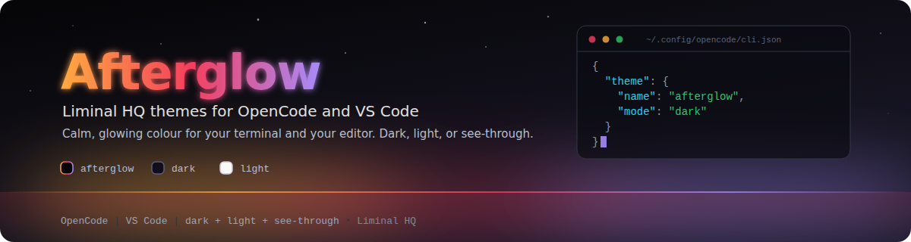

# Afterglow by Liminal HQ

Calm, glowing colour themes for VS Code from [Liminal HQ](https://github.com/liminal-hq): the soft orange, rose and purple that linger on the horizon after the light goes, set against a near-black void. Afterglow is also available for the [OpenCode](https://opencode.ai) terminal UI, so your editor and your terminal agent can share one palette.

## The themes

| Theme               | Mode  | What it is                                                                                                    |
| ------------------- | ----- | ------------------------------------------------------------------------------------------------------------- |
| **Afterglow**       | Dark  | The signature theme. The liminalhq.ca void (`#050507`) with orange accents, for a deep, high-contrast editor. |
| **Afterglow Dark**  | Dark  | A softer, deep indigo-black with purple accents.                                                              |
| **Afterglow Light** | Light | A warm paper theme with deeper accents that hold 4.5:1 contrast on light backgrounds.                         |

Pick one with **Preferences: Color Theme** (`Ctrl+K Ctrl+T`).

## Built on Dark+ and Light+

The syntax colouring keeps every TextMate scope rule and semantic token override from VS Code's built-in Dark+ and Light+ themes, so languages colour the way you expect. Each colour is then replaced with the Afterglow palette: purple keywords, rose control flow and tags, orange functions, green strings, yellow numbers, cyan types and blue constants. The editor, side bar, tabs, status bar, panels, terminal and every other surface are coloured deliberately rather than inherited from the defaults.

Text, syntax and the main UI colours are checked in CI for at least 4.5:1 contrast against the surface they sit on. Deliberately dim elements, such as disabled and ghost text, inactive tabs and ignored files, are held to 3:1.

## The palette

A calm near-black background, a warm orange-to-rose-to-purple family of accents, and cool cyan and blue for information: the colours that recur across the Liminal HQ projects.

## Feedback

Found a colour that looks off? Open an issue at [liminal-hq/afterglow-themes](https://github.com/liminal-hq/afterglow-themes/issues) with a screenshot, the language and the theme name.

## Licence

Dual-licensed under Apache-2.0 or MIT, at your option. The scope coverage is derived from the MIT-licensed Dark+ and Light+ themes in [microsoft/vscode](https://github.com/microsoft/vscode).
